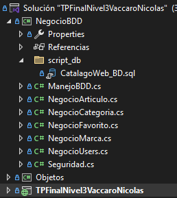

## Trabajo Final Curso Nivel 3 C# ASP.NET :

Pequeña aplicacion web sobre un catalogo de articulos. En este podras ver cada articulo que existen en la aplicacion, aplicando distinto filtros de busqueda sobre estos. Tambien podras registrarte como un usuario para ver a detalle cada articulo que se encuentra en la web, ademas de poder agregar y quitar a una lista de favoritos cuando quieras. 

Para poder visualizar e interacturar con la aplicacion de este tp podes entrar a la siguiente URL : http://www.tpfinalnivel3vaccaronicolas.somee.com/ . 
En caso de que lo quieras correr de manera local, deberas tener los siguientes programas : 

## Requisitos para correr de manera Local:
Debera tener instalado el `Visual Studio Community`. Este programa lo podra bajar en el siguiente link : https://visualstudio.microsoft.com/es/downloads/ . Y ademas necesita tener instalada la base de datos `SQL Server`, que se encontrata en el siguiente link : https://www.microsoft.com/es-es/sql-server/sql-server-downloads . En ambos programas es recomendable la version gratuita ya que es un proyecto sencillo y no muy pesado. 
Ademas en el visual debera instalar las siguientes herramientas para poder correr sin problemas la aplicacion web. En la siguiente `imagen` se muestran cuales herramientas debe tener instaladas. 

Por ultimo debera bajar el proyecto desde git con la siguiente linea en su `git bash` :

`git clone https://github.com/Vaqui26/tp-final-nivel3-Vaccaro-Nicolas.git`

Una vez clonado el repo, ingrese a la carpeta y ejecute el archivo con el nombre :

`TPFinalNivel3VaccaroNicolas.sln`

Este le abrira el `Visual Studio Community` y teniendo ya la BDD, dentro de la biblioteca `NegocioBDD` encontra una carpeta llamada `script_db`. En esta ultima se encuentra un archivo que contiene la creacion de la base de datos con sus tablas para poder interacturar con ella y que la aplicacion funcione correctamente.

Simplemente abra `SQL Server` una vez abierto, eleja `New query` y pege el contenido del archivo, ejecute y vera la base de datos ya creada con sus tablas. 

Finalmente podra ejecutar la aplicacion en el visual donde figura `IIS Express`. 

 

Este le abrira su navegador predeterminado y ya podra interactuar con la app. 

## Detalles al tener en cuenta :

Al querer cambiar una imagen de perfil, esta no se vera instantaneamente. Para que esto suceda debera hacer click derecho en cualquier parte de la pagina, apreta en `inspeccionar`, hacer click derecho de nuevo pero en boton
de refrescar la pagina, y en las opciones que le sugerie, apretar en `Vaciar caché y volver a cargar de manera forzada`. Esto hara que se muestre la imagen de perfil que cambio. 
Es un error visual aun no manejado.

## Disfruta de todo el contenido : 

Para esto debera tener un perfil `Admin`, que permite tener a dispocision toda la funcionalidad de la aplicacion. La cuenta de este es la siguiente : 
`Email` : admin@admin.com 
`Pass` : admin 

Con este usuario podra : agregar, modificar y borrar articulos de la web, ademas de poder darle rol a otros usuarios que se encuentren registrados!!!
